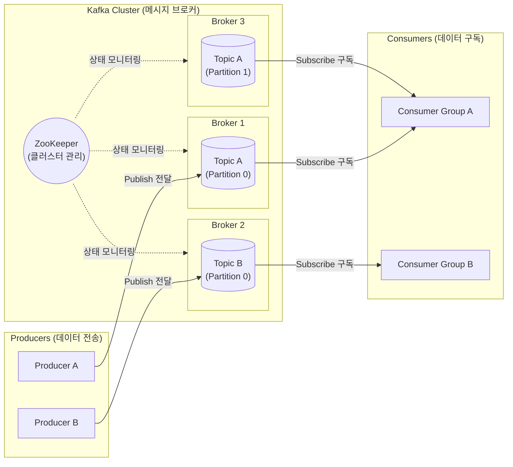
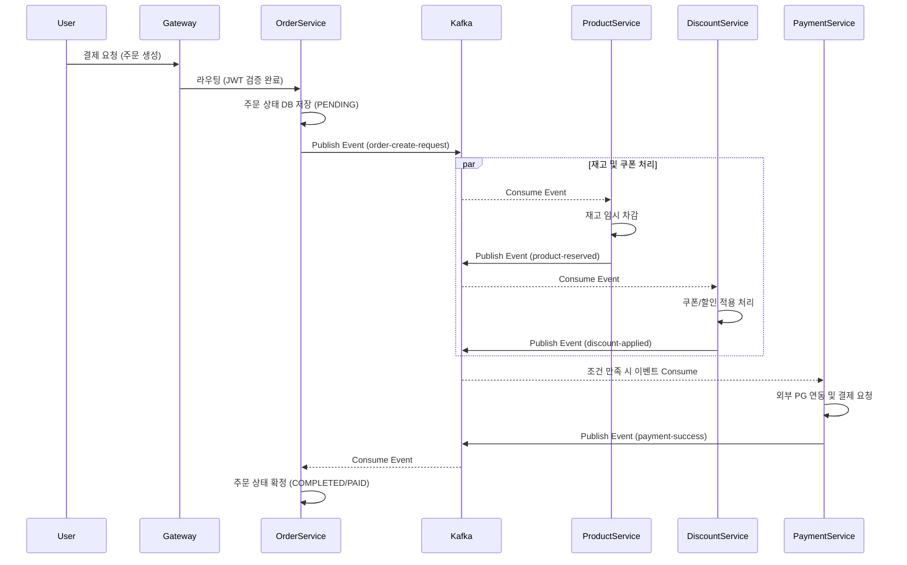
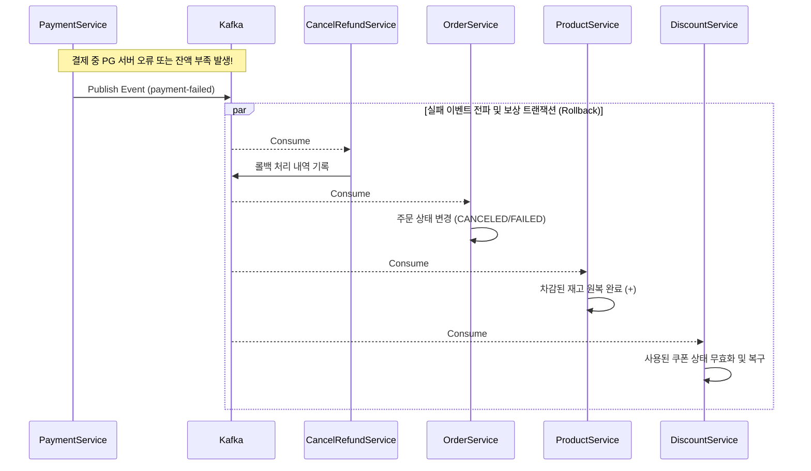

# MSA 환경에서의 비동기 통신: Apache Kafka와 Saga 패턴 도입기

## 서론: 왜 Kafka를 도입했나?

최근 진행 중인 [e-commerce_msa 프로젝트](https://github.com/eatdu0918/e-commerce_msa)는 도메인별로 서비스와 DB가 완벽하게 분리된 MSA(Microservices Architecture) 구조로 설계되었습니다. MSA 환경에서는 각 서비스가 독립성을 가지는 장점이 있지만, 서비스 간의 **결합도(Coupling)를 낮추고 데이터 정합성을 유지하며 분산 트랜잭션을 관리해야 하는** 다소 까다로운 과제가 따릅니다. 

전통적인 REST API 방식의 동기 호출은 한 서비스에 지연이 발생하면 전체 시스템의 병목이나 타임아웃으로 이어질 수 있습니다. 이러한 문제를 해결하고 비동기 이벤트 기반의 유연한 아키텍처를 구축하기 위해, 고성능 메시지 브로커인 **Apache Kafka**를 도입하고 **Saga 패턴(Choreography)**을 적용한 경험을 공유하고자 합니다.

---

## 본론 1: Apache Kafka 핵심 개념 짚어보기

Apache Kafka는 분산형 데이터 스트리밍 플랫폼이자 강력한 오픈소스 메시지 브로커(Message Broker)입니다. 실무에서는 주로 마이크로서비스 간의 데이터 동기화, 이벤트 기반 아키텍처(EDA), 대규모 트래픽 완충 등의 목적으로 사용됩니다.

- **Producer (프로듀서)**: 데이터를 생성하여 특정 토픽으로 메시지를 발행(Publish)합니다.
- **Consumer (컨슈머)**: 토픽을 구독(Subscribe)하여 메시지를 읽고 비즈니스 로직을 처리합니다.
- **Topic (토픽)**: 메시지가 저장되는 논리적인 카테고리 또는 분류 필드(예: `order-created`)입니다.
- **Broker (브로커)**: 전달된 메시지를 파일 시스템에 영속화하고 관리하는 Kafka 서버입니다.

### 🏗️ Kafka 핵심 아키텍처 다이어그램

아래는 프로듀서가 메시지를 발행하고 카프카 클러스터를 거쳐 컨슈머가 이를 구독 처리하는 전체적인 통신 구조입니다.

> 💡 **비동기 통신의 장점**
> "메시지만 안전하게 던져놓고 내 할 일 하기"가 가능해져 서비스 간 응답 속도가 대폭 개선되며, 특정 서버가 일시적으로 다운되어도 메시지가 큐에 안전하게 보관되므로 유실되지 않습니다.

---

## 본론 2: 프로젝트의 핵심 통신 시나리오 (Saga Pattern)

각 DB가 분리된 환경에서는 하나의 `@Transactional` 어노테이션으로 여러 서비스의 작업을 한 번에 묶을 수 없습니다. 따라서 각 서비스의 작업 결과에 따라 이벤트를 연쇄적으로 발행하고, 중간에 장애가 발생할 경우 **보상 트랜잭션(Compensation Event)**을 통해 이전 상태로 원상 복구하는 아키텍처를 구현했습니다.

### 1) 성공적인 주문 및 결제 흐름 (Happy Path)

가장 이상적인 형태의 주문 및 결제 흐름은 다음과 같습니다. 사용자가 결제를 요청하면 이벤트가 순차적으로 전파되며 각 서비스가 비동기적으로 작업을 수행합니다.

1. **[Order Service]** 사용자가 주문을 생성하면 상태를 `PENDING`으로 저장하고, `order-create-request` 이벤트를 발생시킵니다.
2. **[Product & Discount Service]** 이벤트를 인지한 후 각자의 역할(재고 차감, 쿠폰 검증 및 사용 처리)을 수행하고 완료 이벤트를 발행합니다.
3. **[Payment Service]** 타 서비스의 완료 시그널을 바탕으로 조건이 충족되면 PG사 연동 후 결제를 시도하고 `payment-success` 이벤트를 발행합니다.
4. **[Order Service]** 결제 성공 이벤트를 받아 최종적으로 주문 상태를 `COMPLETED`로 확정 업데이트합니다.

### 2) 예외 처리 및 비동기 롤백 흐름 (Compensation Handling)

실무에서는 언제나 예외가 발생할 수 있습니다. 결제 과정 중 잔액 부족이나 외부 PG사 서버 오류가 발생한다면, 앞선 단계에서 이미 차감된 재고와 쿠폰은 어떻게 해야 할까요? 이를 위해 에러 발생 즉시 실패 이벤트를 전파하고 각 서비스의 데이터를 롤백시키는 **보상 트랜잭션**이 작동합니다.

1. **[Payment Service]** 결제 실패 즉시 실패 사유를 담아 `payment-failed` 이벤트를 Kafka 토픽에 발행합니다.
2. **[Order Service]** 주문 데이터의 상태를 `CANCELED` 또는 `FAILED`로 변경하여 구매자가 실패 내역을 확인할 수 있도록 처리합니다.
3. **[Product & Discount Service]** 실패 이벤트를 수신하여 차감된 재고 수량을 구매 이전의 상태로 복구(보상 트랜잭션)하고, 이미 사용 처리 시켰던 쿠폰을 다시 사용할 수 있도록 상태를 초기화합니다.

---

## 결론: Kafka와 Saga 패턴 도입으로 얻은 확실한 이점

이번 `e-commerce_msa` 프로젝트에 Kafka와 Saga 패턴을 적용하면서 다음과 같은 확실한 아키텍처적 이점을 얻을 수 있었습니다.

1. **결합도 분리 (Decoupling):** 주문 서비스(Order)는 상품 서비스(Product)의 내부를 모르더라도 아무런 제약 없이 이벤트를 전송할 수 있습니다. 서로 HTTP 물리 주소를 의존할 필요가 없게 되어 유지보수성이 획기적으로 향상되었습니다.
2. **강력한 장애 격리 (Fault Isolation):** 특정 서비스(예: Product Service)에 서버 다운 등 장애가 발생하더라도, 주문 로직은 정상적으로 접수되어 Kafka에 이벤트가 임시 보관됩니다. 상품 서비스가 복구되면 그동안 밀렸던 이벤트를 마저 읽어가게 되므로 전체 장애로 전파되는 현상을 차단할 수 있었습니다.
3. **손쉬운 시스템 확장 (Scalability):** 트래픽이 평소보다 급증하는 이벤트 기간이 되더라도, 부하가 발생한 Consumer 서버의 인스턴스를 늘리고 파티션 수만 스케일 아웃 해주면 부하를 쉽게 분산시킬 수 있게 되었습니다.

MSA 환경에서 트랜잭션을 분산 관리한다는 것은 쉽지 않은 여정이지만, Kafka 기반의 비동기 메시징 설계를 통해 서비스의 **견고함과 확장성**이라는 두 마리 토끼를 잡을 수 있는 아주 좋은 기반을 다진 계기가 되었습니다.
