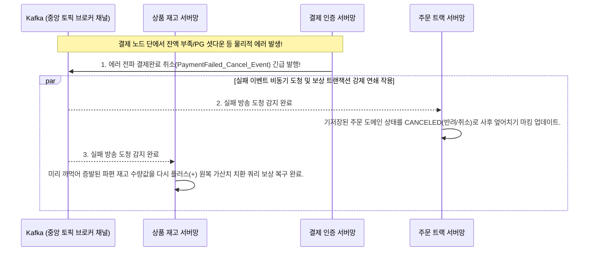

# MSA 환경에서의 비동기 통신: Apache Kafka와 Saga 패턴 도입기

마이크로서비스 아키텍처(MSA) 구조 시스템망 안에서 백엔드 개발자로서 넘어야 했던 가장 험난한 과제는 **분산 시스템 데이터의 무결성(정합성) 보장** 설계였다. 

단일 모놀리식 환경 프로젝트 당시에는 `@Transactional` 어노테이션 하나로 묶어 RDB 롤백의 은혜를 입었으나, 도메인과 DB망이 완전히 물리적으로 단절된 MSA 파티션 구조에서는 동기식 호출(REST API) 한 번의 지연이 전체 장애로 이어지는 치명적인 타임아웃 병목을 도출했다. 이를 해결하기 위해 결합도를 끊어내고 비동기 이벤트 릴레이로 트랜잭션을 수동 엮어내는 **Apache Kafka** 기반의 **Saga 패턴(Choreography)** 통신망 구축 경험을 정리한다.

---

## 1. 아키텍처 결함의 발견: 동기 통신의 연쇄 파탄

초기에는 사용자의 구매 요청 트래픽이 `Gateway` -> `OrderService` -> `ProductService` -> `PaymentService` 로 순차적인 HTTP 동기 통신을 타도록 시스템을 구동시켰다.
하지만 부하 테스트 과정에서 결제 인프라 쪽 외부 API망이 3초간 멎어버리자, 응답을 대기하던 앞단 상품 서버와 주문 서버의 톰캣 스레드 풀이 강제로 고갈되며 결국 멀쩡하던 주문 인프라까지 통째로 셧다운 방출해 버리는 무참한 붕괴 사이드 이펙트 오류를 직면하게 되었다.

---

## 2. 해결 시도: 비동기 논블로킹 엔진 Kafka의 결합

서비스 간 강하게 결합된 네트워크 족쇄를 풀기 위해, "내 알 바 아니니 메시지만 던져두고 난 내 일 하러 간다" 식의 비동기 버퍼링 허브가 필요했다. 이에 대용량 무중단 메시징 브로커 엔진인 **Kafka 클러스터**를 중간 매개 큐로 편입시켰다.

주문 서버가 데이터 수정 커밋을 마치면 다른 서버 주소를 목적지로 직접 호출하는 대신, 중앙 저장소(Topic)에 이벤트를 발행(Publish)하기만 하고 스레드를 반환해 버리는 느슨한(Decoupled) 구조로 설계 구성을 뒤엎기 시작했다.

---

## 3. 분산 트랜잭션 롤백 방어: 부분 실패 대응과 Saga (보상 트랜잭션)

동기 통신을 끊어 스레드 고갈은 잡았지만, 정합성 관리에 구멍이 뚫렸다. 앞단에 위치한 상품 서비스(Product)가 정상적으로 재고를 즉각 `-1` 차감 커밋 했는데 후행 결제망(Payment)에서 잔고 미달 트랜잭션 실패 판정이 터진다면, 물리 세계의 상품 재고 1개는 그대로 증발해 버리는 분열 버그 시나리오가 도출되었다.

### 🏗️ 실패 시 보상 트랜잭션 릴레이 플로우
중앙의 전체 트랜잭션을 묶어줄 관리자가 없으므로, **"실패한 쪽이 큰 소리로 방송하여 앞선 행위를 전부 되돌리게(보상) 스스로 조치하라"** 는 보상 수동 연산 큐 구조망을 시스템 롤백 로직망에 이식했다.

```mermaid
sequenceDiagram
    participant Kafka as Kafka (중앙 토픽 브로커 채널)
    participant Product as 상품 재고 서버망
    participant Payment as 결제 인증 서버망
    participant Order as 주문 트랙 서버망

    Note over Payment,Kafka: 결제 노드 단에서 잔액 부족/PG 셧다운 등 물리적 에러 발생!
    Payment->>Kafka: 1. 에러 전파 결제완료 취소(PaymentFailed_Cancel_Event) 긴급 발행!
    
    par 실패 이벤트 비동기 도청 및 보상 트랜잭션 강제 연쇄 작용
        Kafka-->>Order: 2. 실패 방송 도청 감지 완료
        Order->>Order: 기저장된 주문 도메인 상태를 CANCELED(반려/취소)로 사후 엎어치기 마킹 업데이트.
        
        Kafka-->>Product: 3. 실패 방송 도청 감지 완료
        Product->>Product: 미리 까먹어 증발된 파편 재고 수량값을 다시 플러스(+) 원복 가산치 치환 쿼리 보상 복구 완료.
    end
```

망 외부 써드파티 승인이 작살나서 터졌을 때 즉각 실패 이벤트를 발파하면, 그걸 엿듣고 대기 중이던 타겟 데몬 서버들이 각자의 수동 예외 롤백 DB 반영 패치 업데이트를 조각 맞추듯 기워 붙이는 로직 단위의 방어 코드로 최종 정합성을 짜맞췄다.

---

## 💡 최종 회고 정리 결론

기존 통신 커플링 네트워크의 고리를 가위로 쳐내기 위해 도입했던 비동기 Kafka 릴레이망은 응답 시간 최적화와 스케일 아웃에 거대한 인프라 안정성을 보장해 주었다.
하지만 동기적 강한 일관성을 대가성으로 처분한 뒤편에는, 롤백을 위탁하지 못해 이벤트가 터지는 모든 예외적 실패 붕괴 케이스를 일일이 엔지니어가 수동 보상 트랜잭션 이벤트 핑퐁 로직으로 직접 하드코딩 사수 감당해야만 하는 막중하고 지독한 **복잡성의 늪**이 설계의 이면으로 도사리고 있음을 철저하게 뼈저리게 이력적으로 통감할 수 있었던 구조 학습 경험의 재산이었다.
