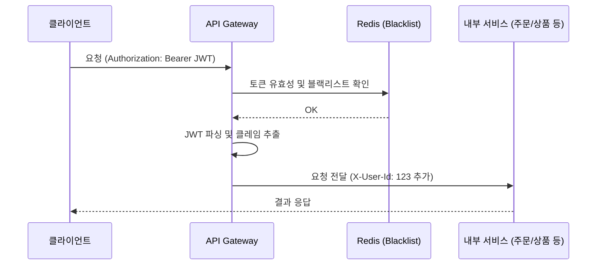

# MSA 보안의 관문: API Gateway와 JWT 중앙 집중형 인증 구축하기

마이크로서비스 아키텍처(MSA)에서는 수십 개의 서비스가 흩어져 있습니다. 만약 각 서비스마다 로그인 여부를 확인하고 권한을 체크하는 로직을 넣는다면 어떨까요? 코드 중복은 물론이고, 인증 방식이 바뀔 때마다 모든 서비스를 수정해야 하는 재앙이 발생할 것입니다.

[`sparta-msa-final-project`](https://github.com/eatdu0918/sparta-msa-final-project)에서는 이를 해결하기 위해 **API Gateway에서 모든 인증을 중앙 집중적으로 처리**하는 전략을 선택했습니다.

---

## 🏗️ 인증 아키텍처: 누가 들어올 수 있는가?

Gateway는 클라이언트의 모든 요청을 가장 먼저 받는 '문지기' 역할을 합니다. 여기서 유효한 사용자인지 검증한 뒤, 인증 정보(사용자 ID, 권한 등)를 헤더에 담아 내부 서비스로 전달합니다.



---

## 🛠️ 핵심 구현: `JwtAuthenticationFilter`

우리 프로젝트의 `gateway-service`에 구현된 인증 필터의 핵심 로직을 살펴보겠습니다.

### 1. 토큰 검증 및 정보 추출
Gateway는 `GlobalFilter` 또는 `AbstractGatewayFilterFactory`를 상속받아 모든 요청을 가로챕니다.

```java
@Component
@Slf4j
public class JwtAuthenticationFilter extends AbstractGatewayFilterFactory<JwtAuthenticationFilter.Config> {
    
    // ... 생략 ...

    @Override
    public GatewayFilter apply(Config config) {
        return (exchange, chain) -> {
            ServerHttpRequest request = exchange.getRequest();

            // 1. Authorization 헤더 확인
            String authHeader = request.getHeaders().getFirst(HttpHeaders.AUTHORIZATION);
            if (authHeader == null || !authHeader.startsWith("Bearer ")) {
                return onError(exchange, "No Authorization Header", HttpStatus.UNAUTHORIZED);
            }

            String token = authHeader.substring(7);

            // 2. JWT 유효성 검증 및 블랙리스트 확인 (Redis 연동)
            if (isTokenBlacklisted(token)) {
                return onError(exchange, "Token is loged out", HttpStatus.UNAUTHORIZED);
            }

            try {
                // 3. JWT 클레임 파싱
                Claims claims = parseJwt(token);
                
                // 4. 내부 서비스에서 사용할 수 있도록 헤더 변조 (Mutate)
                ServerHttpRequest mutatedRequest = exchange.getRequest().mutate()
                        .header("X-User-Id", claims.get("userId").toString())
                        .header("X-User-Role", claims.get("role").toString())
                        .build();

                return chain.filter(exchange.mutate().request(mutatedRequest).build());
            } catch (Exception e) {
                return onError(exchange, "Invalid Token", HttpStatus.UNAUTHORIZED);
            }
        };
    }
}
```

### 2. Redis를 활용한 로그아웃(블랙리스트) 처리
JWT는 무상태(Stateless)가 장점이지만, 강제로 만료시키기 어렵다는 단점이 있습니다. 우리는 사용자가 로그아웃하면 해당 토큰을 **Redis에 '블랙리스트'로 등록**하고, Gateway에서 이를 매번 확인함으로써 보안을 강화했습니다.

```java
private boolean isTokenBlacklisted(String token) {
    // Redis에 해당 토큰 키가 존재하는지 확인
    return Boolean.TRUE.equals(redisTemplate.hasKey("blacklist:" + token));
}
```

---

## 💡 이 방식의 장점

1.  **관심사의 분리**: 내부 서비스(Order, Product 등)는 비즈니스 로직에만 집중할 수 있습니다. 이미 Gateway를 통과했다면 인증된 요청이라고 믿고, 헤더의 `X-User-Id`를 사용하기만 하면 됩니다.
2.  **일관된 보안 정책**: 인증 로직을 수정하고 싶을 때 `gateway-service` 하나만 고치면 전체 시스템에 적용됩니다.
3.  **성능과 보안의 균형**: Redis를 사용해 블랙리스트 확인 속도를 최적화하면서도, JWT의 장점인 빠른 검증을 활용합니다.

## 마무리

MSA를 구축할 때 보안의 시작은 **"Gateway를 어떻게 설계하느냐"**에 달려 있습니다. 이번 프로젝트에서 구축한 통합 인증 시스템은 서비스가 늘어나도 확장하기 쉬운 견고한 기반이 되었습니다.

다음 포스팅에서는 이렇게 인증된 주문 요청이 여러 서비스로 전파될 때, 데이터 정합성을 어떻게 유지하는지(Kafka & Saga 패턴)에 대해 알아보겠습니다!
