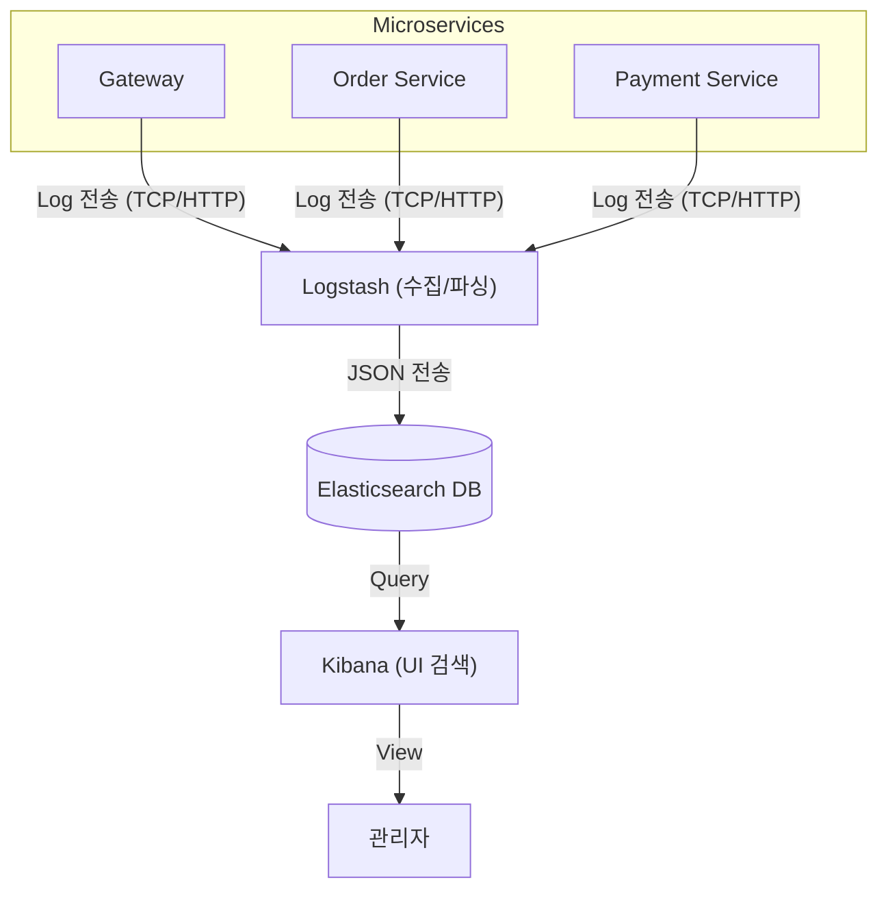

# ELK Stack으로 분산 로그 추적하기

마이크로서비스 아키텍처(MSA)에서 가장 힘든 순간 중 하나는 **"어디가 문제인지 모를 때"**입니다. 사용자의 주문이 왜 실패했는지 알기 위해 주문 서비스 로그를 보고, 다시 상품 서비스 로그를 찾아보고... 이렇게 수작업으로 에러 로그를 짜 맞추는 것은 시간 낭비일 뿐만 아니라 부정확합니다.

[`sparta-msa-final-project`](https://github.com/eatdu0918/sparta-msa-final-project)에서는 **ELK Stack (Elasticsearch, Logstash, Kibana)**을 구축하여 모든 서비스의 로그를 한곳으로 모아 관리하고 있습니다.

---

## 🪵 ELK Stack: 로그의 흐름을 한눈에

1.  **Logstash**: 각 마이크로서비스가 쏘는 로그 데이터를 받아 입맛에 맞게 가공(파싱)한 뒤 저장소로 전달합니다.
2.  **Elasticsearch**: 방대한 로그 데이터를 검색하기 좋게 인덱싱하여 저장하는 강력한 검색 엔진입니다.
3.  **Kibana**: Elasticsearch에 저장된 로그를 웹 브라우저에서 편리하게 검색하고 시각화해 줍니다.



---

## 🛠️ 실전 핵심 설정

### 1. Spring Boot에서 로그 전송하기 (Logback)
애플리케이션은 로그를 콘솔에만 찍는 게 아니라, Logstash로 쏴주어야 합니다. `logstash-logback-encoder`를 사용하면 로그를 JSON 형태로 간편하게 보낼 수 있습니다.

```xml
<!-- logback-spring.xml 예시 -->
<appender name="LOGSTASH" class="net.logstash.logback.appender.LogstashTcpSocketAppender">
    <destination>logstash:5044</destination>
    <encoder class="net.logstash.logback.encoder.LogstashEncoder" />
</appender>
```

### 2. Logstash 설정 (`logstash.conf`)
들어오는 로그를 받아서 Elasticsearch의 어떤 인덱스에 넣을지 정의합니다.

```conf
input {
  tcp {
    port => 5044
    codec => json_lines
  }
}

output {
  elasticsearch {
    hosts => ["http://elasticsearch:9200"]
    index => "msa-logs-%{+YYYY.MM.dd}"
  }
}
```

---

## 🎯 MSA 로그 관리의 핵심: Correlation ID (Trace ID)

ELK Stack이 구축되어 있어도 로그가 뒤섞여 있으면 의미가 없습니다. **하나의 사용자 요청이 여러 서비스를 통과할 때 공유하는 유일한 ID**가 필요합니다.

1.  **Gateway**에서 요청이 들어올 때 `trace_id`를 생성하여 헤더에 담습니다.
2.  각 서비스는 로그를 남길 때마다 이 `trace_id`를 함께 기록합니다.
3.  **Kibana**에서 해당 `trace_id` 하나만 검색하면, **[Gateway -> Order -> Payment -> Product]**로 이어지는 전체 실행 흐름을 코드 수준에서 추적할 수 있습니다.

---

## 마무리

ELK Stack은 구축 비용과 리소스 소모가 적지 않지만, 시스템의 복잡도가 임계치를 넘는 순간 **"가장 든든한 보험"**이 됩니다. 특히 장애 상황에서 로그 한 줄을 찾기 위해 헤매는 시간을 획기적으로 줄여주어, 서비스 복구 골든타임을 확보하게 해줍니다.

이제 포스팅 시리즈의 마지막 순서로, 이 모든 서비스와 인프라를 단 한 줄의 명령어로 띄울 수 있게 해주는 **Docker Compose 개발 환경**에 대해 알아보겠습니다!
