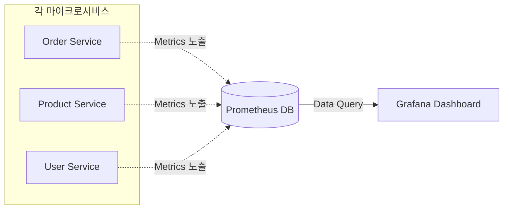

# MSA의 Prometheus와 Grafana로 모니터링 시스템 구축하기

마이크로서비스 아키텍처(MSA)를 도입하면 서비스 개수가 급증합니다. 평소에는 괜찮지만, 장애가 발생했을 때 어떤 서비스의 CPU가 치솟는지, 어떤 API의 응답 시간이 늦어지는지 일일이 서버에 들어가 확인할 수는 없습니다.

[`sparta-msa-final-project`](https://github.com/eatdu0918/sparta-msa-final-project)에서는 업계 표준인 **Prometheus와 Grafana**를 활용하여 시스템 전체를 실시간으로 감시하고 있습니다.

---

## 🏗️ 모니터링 파이프라인: 데이터는 어떻게 수집되는가?

1.  **Spring Boot Actuator**: 각 마이크로서비스는 자신의 상태 지표(CPU, 메모리, HTTP 요청 횟수 등)를 `/actuator/prometheus` 엔드포인트로 노출합니다.
2.  **Prometheus**: 주기적으로 각 서비스의 엔드포인트를 방문하여 지표를 긁어(Scraping) 자신의 시계열 DB에 저장합니다.
3.  **Grafana**: Prometheus에 저장된 데이터를 가져와 사람이 보기 편한 차트와 대시보드로 그려줍니다.



---

## 🛠️ 실무 핵심 설정

### 1. Spring Boot 서비스 설정 (`build.gradle`)
메트릭을 노출하기 위해 라이브러리를 추가해야 합니다.

```gradle
dependencies {
    implementation 'org.springframework.boot:spring-boot-starter-actuator'
    implementation 'io.micrometer:micrometer-registry-prometheus'
}
```

그리고 모든 지표를 외부에서 볼 수 있도록 활성화합니다 (`application.yml`).

```yaml
management:
  endpoints:
    web:
      exposure:
        include: prometheus, health, info
```

### 2. Prometheus 스크래핑 설정 (`prometheus.yml`)
수집 서버에게 "어느 주소로 가서 정보를 가져와!"라고 알려줘야 합니다.

```yaml
scrape_configs:
  - job_name: 'msa-services'
    metrics_path: '/actuator/prometheus'
    static_configs:
      - targets: ['order-service:8082', 'product-service:8081', 'user-service:8080']
```

---

## 📈 무엇을 감시해야 하는가? (Golden Signals)

단순히 지표를 모으는 것보다 중요한 것은 **'어떤 지표가 서비스의 장애를 예고하는가'**입니다.

1.  **Latency (대기 시간)**: 요청을 처리하는 데 걸리는 시간. 느려지면 사용자 경험이 급격히 나빠집니다.
2.  **Traffic (트래픽)**: 시스템에 대한 수요. 갑작스러운 트래픽 폭증은 리소스 고갈로 이어집니다.
3.  **Errors (오류)**: 요청의 실패율. 5xx 에러가 급증한다면 즉시 대응이 필요합니다.
4.  **Saturation (포화 수준)**: 시스템이 얼마나 가득 찼는지. CPU 부하나 Memory 점유율을 통해 서버 스케일 아웃 시점을 파악합니다.

---

## 마무리

적절한 모니터링 도구는 개발자에게 **"안심하고 배포할 수 있는 용기"**를 줍니다. Prometheus와 Grafana를 통해 시스템을 투명하게 들여다볼 수 있게 되면, 장애 대응 시간(MTTR)을 획기적으로 줄일 수 있습니다.

다음 포스팅에서는 지표뿐만 아니라, 문제가 터졌을 때 그 상세한 원인을 찾아낼 수 있는 **ELK Stack을 이용한 로그 관리**에 대해 알아보겠습니다!
