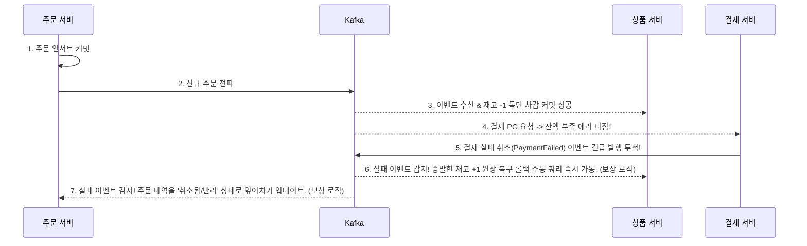

# 분산 트랜잭션 롤백의 고통: Kafka와 보상 트랜잭션(Saga) 설계 경험

마이크로서비스 아키텍처(MSA)를 얕보고 덤볐다가 가장 크게 데였던 부분은 바로 **분산 데이터의 무결성(일관성) 보장**이었습니다. 단일 서버 체제의 `@Transactional` 하나면 알아서 전부 롤백되던 황금기가 끝난 것입니다. 결제망이 터져도 주문 서버는 그 사실을 모른 채 '완료' 처리를 해버리는 무시무시한 데이터 불일치 버그를 해결하기 위해, 비동기 큐 기반의 Saga 패턴 롤백 방어선을 구축했던 땀 눈물 나는 경험을 회고합니다.

---

## 🚫 쪼개진 트랜잭션 망이 불러온 돌이킬 수 없는 버그

이커머스 결제망 테스트 중 시스템의 밑바닥 결함이 드러났습니다.
주문 서비스에 "상태 생성" 커밋이 완료되고, 상품 서비스 서버에도 "재고 -1 차감" 커밋이 정상 완료되었으나 마지막 결제 모듈에서 "카드 한도 초과" 예외가 터져버린 것입니다.

당연히 전체 주문 흐름이 무산되어야 하지만, 상품 서비스 DB는 결제 쪽 에러 사정을 알 턱이 없습니다. 결과적으로 주문은 실패했는데 실물 재고는 영구적으로 1개가 공중분해되어버리는 끔찍한 파편화 데이터 결함 상태를 마주하게 되었습니다.

---

## 🔄 Saga 패턴의 원초적 핵심: "내 데이터는 내가 반대로 되돌린다"

처음에는 동기적으로 락킹을 거는 2-Phase-Commit을 기웃거려 보았으나, 타 서버의 결함이 내 서버의 타임아웃 지연까지 유발하는 커플링 문제 탓에 도입이 불가했습니다. 그래서 대안으로 **Kafka 브로커**를 허브로 활용해 "실패 이벤트"를 전파하고 스스로 복구하게 만드는 **Saga (사가) 보상 트랜잭션 메커니즘**을 베이스로 채택했습니다.

뒤에서 터진 에러 소식을 중앙 큐로 방송하면, 앞서 이미 성공 커밋을 쳐버린 서버들이 그 방송을 듣고 **"정반대의 업데이트 연산(재고 복원 등)"**을 수행하도록 수동 롤백 릴레이를 펼치는 도식도입니다.

### 🏗️ 결재 실패 시 증발 재고 복구 처리 시나리오



---

## 🛠️ 실무 적용 단위 구현: 상품 서버의 롤백 로직 탑재

실제 상품 관리 백엔드 서버 데몬 스레드에 결제망 실패 토픽을 전담 도청하는 파이프라인 리스너를 결속시켰습니다.

### 1. 비동기 구독 큐 실패 감청 리스너 수립
```java
@Component
@RequiredArgsConstructor
public class ProductEventConsumer {
    private final ProductInventoryService productService;

    // 결제망 외부 망이 터졌다는 큐 에러 구독 토픽을 상시 도청
    @KafkaListener(topics = "payment-failed-topic")
    public void executePaymentFailedCompensation(String payload) {
        
        PaymentFailedEvent event = deserializeEventPayload(payload);
        
        // 깎아먹은 수량 변수를 도로 플러스(+) 연산 처리하여 파괴된 데이터 원복
        productService.increaseInventoryStock(event.getProductId(), event.getQuantity());
    }
}
```

### 2. 다중 배달 맹점을 대비한 멱등성 필터(Idempotency Filter) 보완
Kafka 큐망은 네트워크 흔들림이 생길 시 에러 알림 메시지를 두 세번씩 타겟 서버에게 펌핑 발송(At-Least-Once 다중 배송)할 수 있는 재시도 치명적 사이드 이펙트를 항상 내포하고 있습니다. 
따라서 무식하게 들어오는 대로 모조리 재고에 +1을 산술 해버리면 엉뚱 수량 뻥튀기 사태가 나므로, 수신 쪽 백엔드 필터에서 단일 주문 ID 트랜잭션 번호를 기반으로 **'방금 들어온 이 복구 명령이 이미 과거에 종결되어 보상 마킹이 끝난 중복 패킷 로그인가?'**를 체크 검수하는 자체 멱등성 데이터 히스토리 검사 스펙을 코어 쿼리에 반드시 선행 연계시켜 예외를 방어해 내야 했습니다.

---

## 💡 종합 회고 고찰

Saga 매개 파이프라인으로 거대한 보상 트랜잭션 생태계 철조망을 시스템 내부에 직접 하드 코딩해 얽매고 난 뒤, RDB가 기본 제공해주던 편리한 물리적 롤백의 부재가 얼마나 막대한 개발 복잡성 튜닝 비용을 부르는지 진정으로 깨닫게 되었습니다. 

이벤트 기반의 비동기 채널 뒤편에서 '결국 언젠가는 수습되어 맞춰진다'는 결과적 정합성(Eventual Consistency)이라는 이질적 패러다임을 메달기 위해, 개발자가 수작업으로 각 예외 발생 건마다 보상 원상 연산 쿼리 구조 플로우를 수공예 하듯 한 땀 한 땀 역방향으로 꿰매고 묶어야 한다는 처절한 트레이드오프 설계 본질을 몸소 터득한 가장 큰 아키텍처 실무 성장이었습니다.
