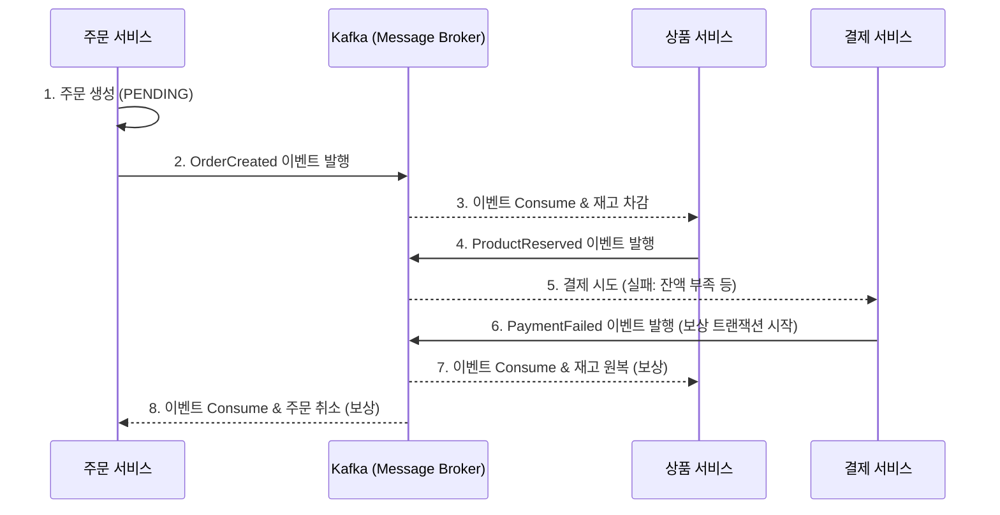

# MSA의 난제, 분산 트랜잭션 해결하기: Kafka와 Saga 패턴

마이크로서비스 아키텍처(MSA)에서 가장 골치 아픈 문제는 **여러 서비스에 걸친 데이터의 일관성**을 유지하는 것입니다. 주문 서비스에서 DB에 저장했는데, 결제 서비스에서 장애가 발생한다면? 이미 차감된 재고는 유령처럼 사라지게 됩니다.

[`sparta-msa-final-project`](https://github.com/eatdu0918/sparta-msa-final-project)에서는 이를 해결하기 위해 2PC(2-Phase Commit) 대신, 성능과 가용성이 뛰어난 **Saga 패턴(Choreography)**을 도입했습니다.

---

## 🔄 Saga 패턴이란? (보상 트랜잭션의 마법)

Saga 패턴은 하나의 큰 트랜잭션을 여러 개의 **로컬 트랜잭션**으로 쪼개고, 각 서비스는 자신의 작업을 마친 뒤 이벤트를 발행합니다. 만약 중간에 에러가 발생하면, 앞서 성공한 작업들을 원상복구 시키는 **보상 트랜잭션(Compensation Event)**을 연쇄적으로 발생시킵니다.

### 🏗️ 시나리오: 결제 실패 시 재고 복구 흐름



---

## 🛠️ 실전 코드 분석: 보상 트랜잭션 구현

실제 상품 서비스(`product-service`)에서 결제 실패 이벤트를 받아 재고를 복구하는 로직을 살펴보겠습니다.

### 1. 이벤트 컨슈머 (`ProductEventConsumer`)
Kafka 토픽을 구독하다가 `payment-failed` 시그널이 오면 즉시 복구 로직을 가동합니다.

```java
@Component
@Slf4j
@RequiredArgsConstructor
public class ProductEventConsumer {
    private final ProductService productService;

    @KafkaListener(topics = "payment-failed-topic", groupId = "product-group")
    public void handlePaymentFailed(String message) {
        log.info("결제 실패 이벤트 수신, 재고 복구 시작: {}", message);
        PaymentFailedEvent event = deserialize(message); // JSON 파싱
        
        // 보상 트랜잭션 실행
        productService.increaseStock(event.getProductId(), event.getQuantity());
    }
}
```

### 2. 멱등성 있는 복구 로직
보상 트랜잭션은 네트워크 이슈 등으로 여러 번 실행될 수 있습니다. 따라서 **동일한 주문에 대해 두 번 복구되지 않도록** 처리하는 것이 핵심입니다.

```java
@Transactional
public void increaseStock(Long productId, Integer quantity) {
    Product product = productRepository.findById(productId)
            .orElseThrow(() -> new RuntimeException("상품 없음"));
            
    // 실제 프로젝트에서는 '이미 복구된 주문인가?'를 확인하는 로그성 체크(Idempotency)가 필요합니다.
    product.addStock(quantity); 
    log.info("재고 복구 완료: productId={}, 복구수량={}", productId, quantity);
}
```

---

## 💡 Saga 패턴 도입 시 주의할 점

1.  **At-Least-Once Delivery**: Kafka는 메시지가 '최소 한 번' 전달되는 것을 보장합니다. 따라서 중복 메시지를 받아도 안전하도록 **컨슈머의 멱등성(Idempotency)**을 반드시 확보해야 합니다.
2.  **격리성(Isolation) 부족**: Saga 패턴은 완료되기 전까지 데이터가 중간 상태(PENDING 등)로 보일 수 있습니다. 이를 사용자에게 어떻게 노출할지 UX 관점의 고민이 필요합니다.
3.  **복잡한 롤백 경로**: 서비스가 늘어날수록 에러 발생 시 되돌아가야 하는 경로가 복잡해집니다. 이를 잘 관리하기 위해 이벤트 스키마를 명확히 정의해야 합니다.

## 마무리

분산 트랜잭션은 MSA의 가장 큰 숙제이지만, Kafka와 Saga 패턴을 조합하면 강한 일관성 대신 **최종 정합성(Eventual Consistency)**을 확보하여 시스템의 확장성과 안정성을 동시에 챙길 수 있습니다.

다음 포스팅에서는 이 모든 서비스가 어떻게 자기만의 DB를 가지고 살아가고 있는지, **Database per Service** 패턴에 대해 다뤄보겠습니다!
