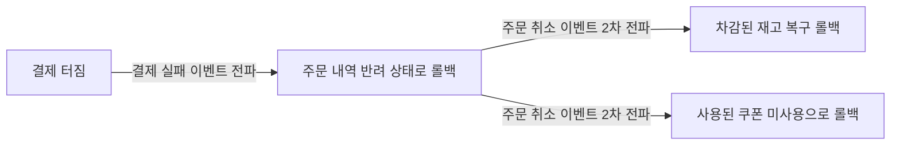

# 이벤트 기반 데이터 정합성 맞추기: Choreography 기반 Saga 구조 경험

분산 환경에서 각자의 DB 데이터를 원자적(All or Nothing)인 것처럼 묶어내기 위해서 **Saga 패턴 (보상 트랜잭션)** 개념을 알게 된 이후, 이를 시스템 로직으로 어떻게 이어 붙일지 고민에 빠졌습니다.

Saga 구축 방식은 중앙 통제자가 모든 순서를 지휘하는 Orchestration 방식과, 서비스들이 서로 이벤트망만 보고 각자의 할 일을 자율적으로 해치우는 **Choreography 방식**으로 나뉩니다. 시스템 결합도를 타이트하게 묶고 싶지 않다는 일념 하나로 도전했던 Choreography(안무) 방식형 구조의 훈련기를 남깁니다.

---

## 🏗️ 릴레이 구조: 무전기를 통한 눈치껏 행동하기 (Choreography)

이 방식 체계 안에서는 프로젝트 내부 서버들을 지휘하는 총괄 컨트롤 타워 객체가 결코 존재하지 않습니다. 모든 서비스 인스턴스는 오로지 메시지 브로커(Kafka)를 통해 울려 퍼지는 무언의 '이벤트 방송'에만 의존하여 다음 스텝을 밟았습니다.

- 주문 서버: "주문 내역 DB 넣었음! 다음 순서 알아서 진행 요망." (방송)
- 상품 서버: "(방송 듣고) 어 주문 들어왔네? 내 DB 재고 목록 차감 시킴!" (방송)
- 결제 서버: "(방송 듣고) 결제 카드 승인 요청 따냄!"

---

## 🛠️ 실무 적용: 연쇄적인 보상 트랜잭션 릴레이 (에러 발생 턴)

각자의 알림에 의존하다 보니 장애 상황 시의 롤백 또한 이벤트 브로드캐스팅 라디오로만 의존해야 했습니다. 결제 망에서 통신 장애가 터졌을 때, 기존에 실행되었던 트랜잭션을 원복시키는 연쇄 보상 릴레이 구조는 마치 도미노가 무너지듯 역방향으로 전달되었습니다.

### 실패 및 방어 보상 트랜잭션 발생 플로우



**1. 주문 서비스: 결제단 실패 브로드캐스트 수신 및 자체 취소 상태 변경**
```java
@Component
public class OrderEventConsumer {
    @KafkaListener(topics = "payment-failed-topic")
    public void executePaymentFailCompensation(PaymentFailedEvent event) {
        // 내 DB의 주문 건을 강제로 CANCEL 처리 롤백 (1차 보상)
        orderService.revertToCancelOrder(event.getOrderId());
        
        // 내 처리가 끝났으니, 재고나 부가정보도 원상복귀 하라고 2차 릴레이 방송 송출
        eventProducer.publish("order-cancelled-topic", event.getOrderId());
    }
}
```

**2. 상품 서비스: 2차 릴레이 방송을 듣고 최종 재고 원복 완료 (2차 보상)**
```java
@Component
public class ProductEventConsumer {
    @KafkaListener(topics = "order-cancelled-topic")
    public void executeStockRevertCompensation(OrderCancelledEvent event) {
        // 이전에 빠져버린 재고를 다시 +1 복구 쿼리 가동
        productService.increaseStock(event.getProductId(), event.getQuantity());
    }
}
```

---

## ⚖️ 체감한 아키텍처의 한계와 성과

### 성과
1. **결합도의 완벽한 분리**: 어떤 서버가 죽거나 코드가 재편되더라도, 오직 "이벤트 문자열 정보"만 주고받으므로 서비스들 간의 직접 통신망 커플링이 대폭 낮아지는 가치를 수확했습니다.
2. **단일 실패 지점(SPOF) 방어**: 통제를 담당하는 중앙 인스턴스가 따로 존재하는 것이 아니므로, 전체 인프라 라인이 멈춰 시스템 통제권 자체가 날아가는 리스크가 최소화되었습니다.

### 부채와 한계점
1. **스파게티 이벤트 플로우 추적의 난해성**: 3개 이상의 서버망이 엮이는 릴레이에서 시스템의 현재 스텝이 어디까지 나아갔는지, 에러가 터졌다면 도대체 어디서 터져서 어디까지 보상되었는지 모니터링하기가 극도로 까다로웠습니다.
2. **사이클릭 루프 위험성**: 자칫 방송 토픽(Topic)을 오타로 잘못 발행하거나 로직이 꼬이게 짜면, 핑퐁을 주고받듯 두 서버가 계속해서 서로의 이벤트를 무한정 건드려 시스템 데이터가 마비되는 리스크를 항상 염두에 두어야 했습니다.

---

## 💡 최종 회고

순수 이벤트 구독 채널 기반의 Choreography 방식 Saga 패턴은, 중앙 통제 로직 비용 없이 스마트하게 데이터 정합성 구멍을 간접적으로 메워주는 매력적인 대안 수단이었습니다.

하지만 요구사항 스펙이 거대해지고 관여하는 서비스 도메인의 숫자가 4개를 초과하는 순간부터, 흐름 통제 엔진을 탑재시킨 Orchestration 베이스로 강제 롤아웃 아키텍팅을 해야겠다는 뼈저린 교훈을 얻을 수 있었습니다.
