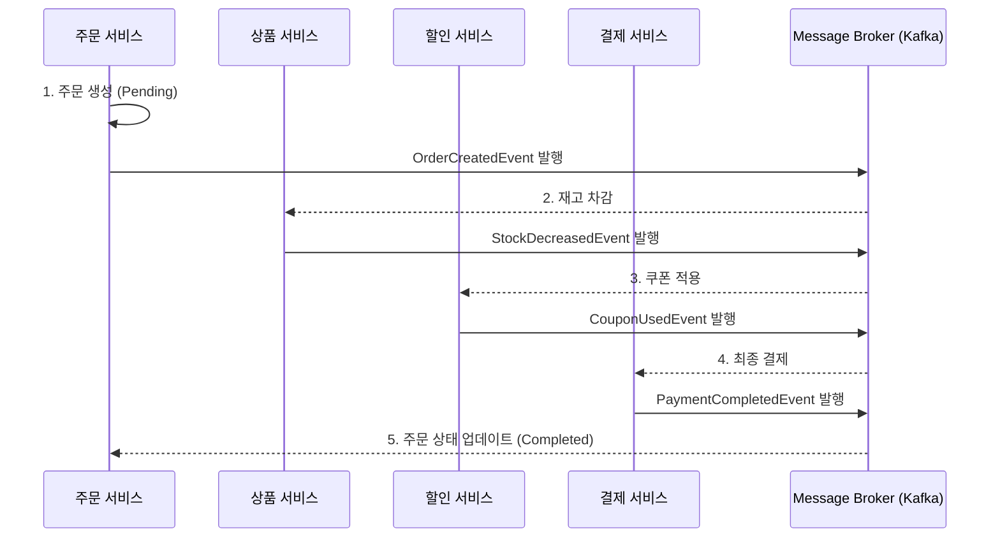
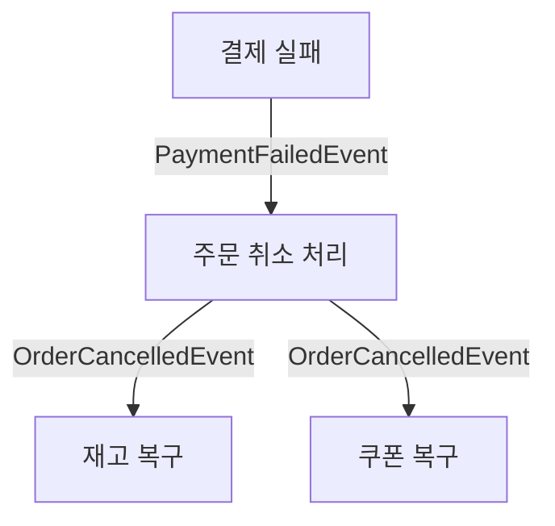

# MSA에서 분산 트랜잭션 해결하기: Saga 패턴 (Choreography)

마이크로서비스 아키텍처(MSA)에서 가장 까다로운 문제 중 하나는 여러 서비스에 걸쳐 있는 비즈니스 로직의 **데이터 일관성(Data Consistency)**을 어떻게 유지하느냐입니다.

이전 포스팅에서 다룬 [Transactional Outbox 패턴]이 '이벤트 발행의 원자성'을 해결해준다면, 오늘 소개할 **Saga 패턴**은 '여러 서비스 간의 트랜잭션 관리'를 담당합니다.

특히 실제 프로젝트 [e-commerce_msa](https://github.com/eatdu0918/e-commerce_msa)에 적용된 **Choreography-based Saga** 방식을 중심으로 알아보겠습니다.

---

## 🧐 Saga 패턴이란?

Saga 패턴은 분산 트랜잭션을 구현하는 방식 중 하나로, 로컬 트랜잭션을 순차적으로 실행하며 각 단계가 성공하면 다음 단계로 넘어가고, 실패하면 이전 단계들을 취소하는 **보상 트랜잭션(Compensating Transaction)**을 실행하는 패턴입니다.

### 핵심 개념: 보상 트랜잭션
Saga 패턴에는 ACID 트랜잭션의 'Rollback' 개념이 없습니다. 대신, 이미 Commit된 로컬 트랜잭션을 논리적으로 취소하는 별도의 작업을 수행해야 하는데, 이를 보상 트랜잭션이라고 합니다.

- **결제 성공 시**: 주문 상태 완료 (정방향)
- **결제 실패 시**: 차감했던 재고 복구 (역방향/보상)

---

## 🏗️ Choreography-based Saga (안무 방식)

별도의 중앙 제어자(Orchestrator) 없이, 각 서비스가 이벤트를 발행하고 구독하며 자율적으로 트랜잭션을 이어가는 방식입니다.

### e-commerce_msa의 정상 흐름 (Happy Path)



각 서비스는 자기가 할 일을 하고 "나 이거 했어!"라고 이벤트를 던집니다. 다음 서비스는 그 이벤트를 보고 자기 할 일을 이어서 수행합니다.

---

## 🛠️ 실무 적용 사례: 보상 트랜잭션 구현

만약 마지막 단계인 **결제 서비스**에서 잔액 부족 등으로 결제가 실패한다면 어떻게 될까요? 이미 차감된 재고와 사용 처리된 쿠폰을 다시 원복해야 합니다.

### 실패 및 보상 트랜잭션 흐름



### 💻 코드 예시 (Java/Spring)

**1. 주문 서비스: 실패 이벤트 수신 및 취소 이벤트 발행**

```java
@Component
@RequiredArgsConstructor
public class OrderEventConsumer {
    private final OrderService orderService;
    private final OrderEventProducer eventProducer;

    @KafkaListener(topics = "payment-failed")
    public void handlePaymentFailed(PaymentFailedEvent event) {
        // 주문 상태를 CANCELLED로 변경
        orderService.cancelOrder(event.getOrderId());
        
        // 다른 서비스들에게 롤백을 요청하는 이벤트 발행
        eventProducer.publishOrderCancelled(new OrderCancelledEvent(event.getOrderId()));
    }
}
```

**2. 상품 서비스: 보상 트랜잭션 수행 (재고 복구)**

```java
@Component
@RequiredArgsConstructor
public class ProductEventConsumer {
    private final ProductService productService;

    @KafkaListener(topics = "order-cancelled")
    public void rollbackStock(OrderCancelledEvent event) {
        // 이전에 차감했던 재고를 다시 증액
        productService.increaseStock(event.getProductId(), event.getQuantity());
        log.info("보상 트랜잭션 실행: 상품 {} 재고 복구 완료", event.getProductId());
    }
}
```

---

## ⚖️ 장점과 단점

### 장점
1.  **느슨한 결합(Loose Coupling)**: 중앙 제어자가 없어 서비스 간 의존성이 낮고 독립적으로 확장 가능합니다.
2.  **단순성**: 소규모 시스템에서는 구현이 빠르고 직관적입니다.

### 단점
1.  **가시성 부족**: 트랜잭션이 현재 어느 단계에 있는지 한눈에 파악하기 어렵습니다. (추적을 위한 분산 트레이싱 필수)
2.  **순환 의존성**: 서비스가 많아지면 이벤트가 꼬여 사이클이 발생할 위험이 있습니다.

---

## 결론

Saga 패턴은 MSA에서 데이터 정합성을 포기하지 않으면서도 시스템의 가용성을 높일 수 있는 강력한 도구입니다. 

특히 **Choreography 방식**은 Kafka와 같은 메시지 브로커를 활용하여 서비스 간 자율성을 극대화할 수 있습니다. 시스템이 더 복잡해진다면 중앙에서 흐름을 관리하는 **Orchestration 방식**도 고려해 볼 수 있지만, 처음 시작은 `e-commerce_msa` 프로젝트처럼 이벤트 기반의 안무 방식으로 시작하는 것을 추천합니다.

보상 트랜잭션 구현 시에는 반드시 **멱등성(Idempotency)**을 고려하여 중복 이벤트 처리에도 안전하게 설계해야 한다는 점을 잊지 마세요!
