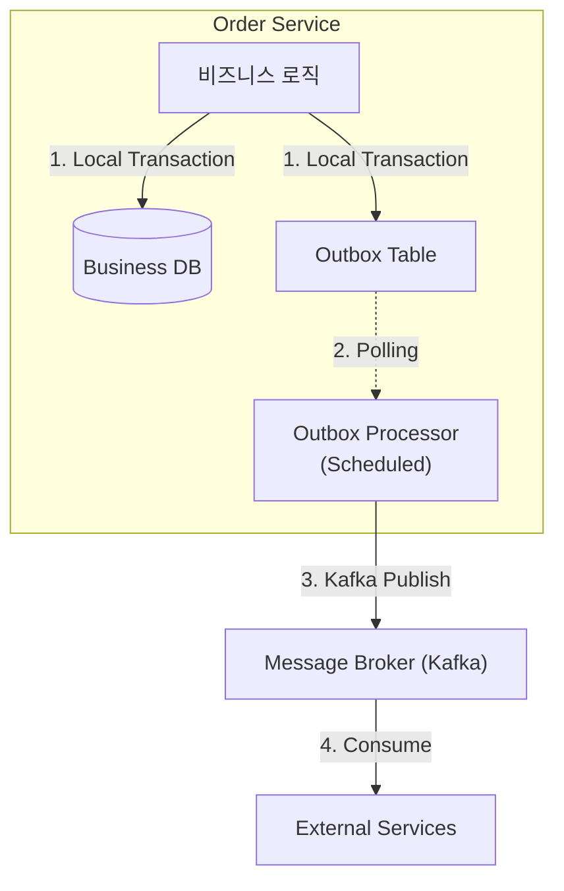

# MSA에서 분산 트랜잭션 해결하기: Transactional Outbox 패턴

마이크로서비스 아키텍처(MSA)에서 각 서비스가 독립적인 DB를 가질 때 가장 큰 고민거리는 **"어떻게 데이터 정합성을 유지할 것인가?"**입니다. 특히 트랜잭션 내에서 **비즈니스 로직(DB Update)**과 **이벤트 발행(Message Send)**을 동시에 처리할 때 발생하는 '이벤트 유실' 문제는 시스템의 신뢰도를 떨어뜨리는 치명적인 요인이 됩니다.

오늘 포스팅에서는 최근 진행한 [`sparta-msa-final-project`](https://github.com/eatdu0918/sparta-msa-final-project)에서 이 문제를 어떻게 해결했는지, 실제 구현 코드를 바탕으로 **Transactional Outbox 패턴**을 소개하겠습니다.

---

## 🧐 왜 이 패턴이 필요한가? (Dual Write 문제)

주문(Order)이 생성될 때 재고 차감이나 결제 요청을 위해 Kafka로 이벤트를 보내야 한다고 가정해 봅시다.

```java
@Transactional
public void createOrder(Order order) {
    orderRepository.save(order); // 1. DB 저장
    kafkaTemplate.send("order-created", order); // 2. 이벤트 발행
}
```

만약 1번은 성공했는데 네트워크 장애로 2번이 실패한다면? 주문은 들어왔는데 후속 처리가 전혀 되지 않는 정합성 오류가 발생합니다. 반대로 2번은 성공했는데 1번 트랜잭션이 롤백된다면, 유령 주문에 대해 결제나 재고 차감이 일어나는 더 심각한 문제가 생기죠.

이러한 **Dual Write** 문제를 해결하기 위해, 이 는 DB와 메시지 브로커를 묶는 대신 **DB 트랜잭션의 원자성(Atomicity)**을 활용하기로 했습니다.

---

## 🛠️ 구현 전략: `sparta-msa-final-project` 사례

이 프로젝트에서는 이벤트를 즉시 발행하지 않고, 비즈니스 DB의 `outbox_events` 테이블에 먼저 저장한 뒤 별도의 프로세스가 이를 읽어 발행하는 방식을 채택했습니다.

### 🏗️ 아키텍처 다이어그램



### 1. Outbox 엔티티 모델링

단순히 이벤트를 저장하는 것을 넘어, **상태 관리(PENDING, PROCESSED, FAILED)**와 **재시도 횟수(retryCount)**를 포함하여 견고함을 더했습니다.

```java
@Entity
@Getter
@Builder
public class OutboxEvent {
    @Id
    @GeneratedValue(strategy = GenerationType.IDENTITY)
    Long id;

    String aggregateType; // 예: "Order"
    String aggregateId;   // 주문 번호 등
    String eventType;     // "OrderCreatedEvent"
    String topic;         // Kafka 토픽명
    
    @Column(columnDefinition = "TEXT")
    String payload;       // JSON 직렬화 데이터

    @Enumerated(EnumType.STRING)
    OutboxStatus status;  // PENDING, PROCESSED, FAILED

    Integer retryCount;
    LocalDateTime createdAt;
    LocalDateTime processedAt;

    public void markAsProcessed() {
        this.status = OutboxStatus.PROCESSED;
        this.processedAt = LocalDateTime.now();
    }

    public void markAsFailed() {
        this.status = OutboxStatus.FAILED;
        this.retryCount++;
    }
}
```

### 2. 이벤트 발행 위임 (`OutboxEventPublisher`)

서비스 로직에서 Outbox 테이블 저장을 직접 처리하지 않도록 캡슐화했습니다. 이를 통해 핵심 비즈니스 로직과 인프라 관심사를 분리합니다.

```java
@Component
@RequiredArgsConstructor
public class OutboxEventPublisher {
    private final OutboxEventRepository outboxEventRepository;
    private final ObjectMapper objectMapper;

    @Transactional
    public void publishOrderCreatedEvent(OrderCreatedEvent event) {
        saveOutboxEvent("Order", event.getOrderNumber(), "OrderCreatedEvent", 
                       KafkaConfig.TOPIC_ORDER_CREATED, event);
    }

    private void saveOutboxEvent(...) {
        String payload = objectMapper.writeValueAsString(event);
        OutboxEvent outboxEvent = OutboxEvent.create(..., payload);
        outboxEventRepository.save(outboxEvent);
    }
}
```

### 3. 메시지 릴레이 (`OutboxProcessor`)

Spring의 `@Scheduled`를 활용하여 주기적으로 `PENDING` 상태의 이벤트를 읽어 Kafka로 전송합니다.

```java
@Component
@RequiredArgsConstructor
public class OutboxProcessor {
    private final OutboxEventRepository outboxEventRepository;
    private final KafkaTemplate<String, String> kafkaTemplate;

    @Scheduled(fixedDelay = 1000)
    @Transactional
    public void processOutboxEvents() {
        // 1. 처리 대기 중인 이벤트 조회
        List<OutboxEvent> events = outboxEventRepository.findByStatus(OutboxStatus.PENDING);

        for (OutboxEvent event : events) {
            try {
                // 2. Kafka 발행
                kafkaTemplate.send(event.getTopic(), event.getAggregateId(), event.getPayload());
                // 3. 처리 성공 마킹
                event.markAsProcessed();
            } catch (Exception e) {
                // 4. 실패 시 상태 변경 및 재시도 카운트 증가
                event.markAsFailed();
            }
        }
    }
}
```

---

## 📈 한 걸음 더: 실무에서 고려한 것들

### 1. At-Least-Once Delivery와 멱등성
이 패턴은 **최소 한 번 전달**을 보장합니다. Kafka 전송은 성공했지만 DB 업데이트(`PROCESSED`)가 완료되기 전 서버가 죽으면 중복 발행될 수 있습니다. 따라서 이벤트를 받는 **모든 컨슈머는 멱등성을 보장**하도록 설계했습니다.

### 2. 가용성과 성능
- **Retry 로직**: 실패한 이벤트는 특정 횟수만큼 자동 재시도하도록 `retryFailedEvents()` 스케줄러를 추가했습니다.
- **Cleanup**: 계속 쌓이는 로그 성격의 Outbox 테이블을 관리하기 위해, 처리 완료된 지 7일이 지난 데이터는 자동으로 삭제하는 `cleanupProcessedEvents()` 로직을 포함했습니다.

---

## 결론

Transactional Outbox 패턴은 분산 시스템에서 메시지 발행의 신뢰성을 확보하는 가장 현실적이고 강력한 방법입니다.

물론 Polling 방식은 DB 부하를 줄 수 있으므로, 트래픽이 매우 큰 경우 **Debezium**을 활용한 **CDC(Change Data Capture)** 방식으로의 전환도 고려해 볼 수 있습니다. 현재 이  프로젝트 수준에서는 Polling 방식으로도 충분히 안정적인 정합성을 유지하고 있습니다.

MSA 환경에서 "이벤트가 사라졌어요!"라는 버그 리포트를 받고 싶지 않다면, 지금 바로 Outbox 패턴 도입을 검토해 보세요!
