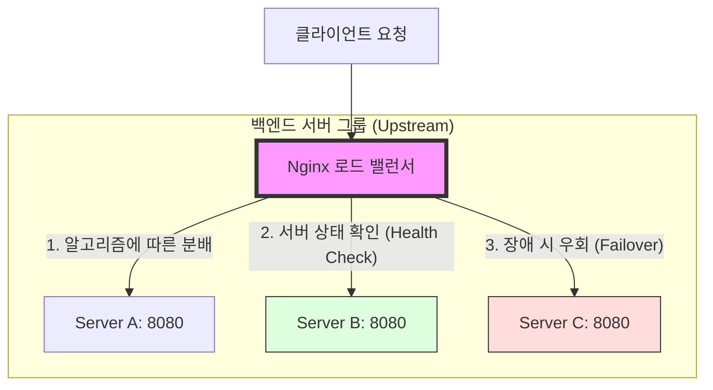

웹 애플리케이션의 규모가 커지고 동시 접속자 수가 급격히 늘어날 때, 백엔드 개발자로서 가장 먼저 마주하는 관문 중 하나는 '웹 서버'의 선택입니다. 단순히 정적 파일을 서빙하는 용도를 넘어 리버스 프록시, 로드 밸런서로서의 역할까지 수행하는 웹 서버 아키텍처를 심도 있게 이해하는 것은 시스템 전체의 병목 현상을 해결하는 핵심 열쇠가 됩니다.

이번 포스팅에서는 현대 웹 인프라의 표준으로 자리 잡은 **Nginx**의 고성능 비결과, 수십 년간 웹의 기반을 지탱해온 **Apache HTTP Server**의 차이점을 아키텍처 관점에서 분석한 내용을 정리해 보았습니다.

---

## 웹 서버가 직면한 도전: C10K 문제

웹 서버 학습을 시작하며 가장 흥미로웠던 지점은 **C10K(Client 10,000 Connections)** 문제입니다. 1999년 댄 케겔(Dan Kegel)이 제기한 이 문제는 "어떻게 하면 단일 서버에서 10,000개의 동시 접속을 효율적으로 처리할 것인가?"에 대한 고민을 담고 있습니다.

과거의 서버들은 접속마다 프로세스나 스레드를 새로 생성하는 방식을 취했습니다. 하지만 동시 접속자가 기하급수적으로 늘어나자 다음과 같은 한계에 부딪혔습니다.

1.  **메모리 부족**: 각 스레드마다 할당되는 스택 메모리가 누적되어 RAM이 고갈됨.
2.  **컨텍스트 스위칭(Context Switching) 오버헤드**: CPU가 수만 개의 스레드를 전환하며 상태를 저장하고 불러오는 데 너무 많은 자원을 소모함.

Nginx는 바로 이 문제를 해결하기 위해 탄생했습니다.

---

## Nginx의 심장: 이벤트 기반 비동기 아키텍처

Nginx는 전통적인 '1 연결당 1 프로세스/스레드' 모델에서 완전히 탈피했습니다.

### Master-Worker 프로세스 모델
Nginx를 실행하면 하나의 **Master 프로세스**와 여러 개의 **Worker 프로세스**가 생성됩니다. Master 프로세스는 설정을 읽고 Worker 프로세스를 관리하는 역할을 하며, 실제 요청 처리는 Worker 프로세스가 담당합니다.


### 이벤트 루프와 비차단 I/O (Non-blocking I/O)
Nginx의 고성능 비결은 Worker 프로세스가 내부에서 실행하는 **이벤트 루프**에 있습니다.

1.  **단일 스레드 처리**: 각 Worker 프로세스는 단일 스레드로 동작하며, 수천 개의 연결을 하나의 루프 안에서 관리합니다.
2.  **비차단 동작**: I/O 작업(네트워크 패킷 수신, 파일 읽기 등)이 완료될 때까지 기다리지(Block) 않습니다. 대신 OS의 이벤트 알림 메커니즘(`epoll`, `kqueue` 등)을 사용하여, 작업이 완료된 시점에만 관련 이벤트를 처리합니다.

이 방식 덕분에 Nginx는 아주 적은 수의 프로세스만으로도 수만 개의 동시 접속을 최소한의 메모리 점유율로 처리할 수 있습니다.

---

## Apache의 진화: MPM (Multi-Processing Modules)

오랫동안 웹의 제왕이었던 Apache 역시 성능 최적화를 위해 여러 모델을 발전시켜 왔습니다. 이를 MPM이라 부릅니다.

### 1. Prefork MPM
각 요청마다 독립된 프로세스를 생성하는 방식입니다. 한 프로세스가 죽어도 다른 프로세스에 영항을 주지 않아 안정적이지만, 동시 접속이 늘어나면 메모리 소모가 막대합니다. (주로 PHP-FPM 이전의 모듈형 PHP 사용 시 활용되었습니다.)

### 2. Worker MPM
프로세스와 스레드를 혼합하여 사용합니다. 프로세스 당 여러 스레드를 두어 Prefork보다 메모리 효율이 좋지만, 여전히 연결마다 스레드를 점유하는 구조적 한계가 있습니다.

### 3. Event MPM (Apache의 응답)
Nginx의 이벤트 기반 방식에 자극을 받아 등장한 모델입니다. **Listener 스레드**가 연결을 관리하고, 실제로 데이터 처리가 필요한 시점에만 **Worker 스레드**에 작업을 넘깁니다. 이는 유휴 상태(Idle)의 Keep-alive 연결이 스레드를 계속 점유하던 문제를 해결하며 Apache의 성능을 비약적으로 끌어올렸습니다.

---

## 깊이 있는 비교: Nginx vs Apache

| 특징            | Nginx                             | Apache (Event MPM)                        |
| :-------------- | :-------------------------------- | :---------------------------------------- |
| **핵심 모델**   | 이벤트 기반 비동기 (Event-driven) | 프로세스/스레드 기반 (Multi-threaded)     |
| **동시 접속**   | 적은 자원으로 수만 개 처리 가능   | 상대적으로 자원 소모가 크나 비약적 개선됨 |
| **정적 컨텐츠** | 매우 빠름 (sendfile 등 최적화)    | 우수하지만 Nginx에 비해 상대적으로 느림   |
| **설정 편의성** | 중앙 집중형 설정 (속도 중심)      | `.htaccess` 지원 (디렉토리별 유연성)      |
| **동적 컨텐츠** | 외부 프로세스(PHP-FPM 등)로 전달  | 모듈(mod_php 등)을 통한 직접 처리 가능    |

---

## 로드 밸런싱: 가용성을 보장하는 지능적 분배

고성능 웹 서버 학습 과정에서 리버스 프록시와 로드 밸런싱의 원리를 깊이 있게 파악하는 것은 매우 중요합니다. Nginx는 단순히 요청을 전달하는 것을 넘어, 여러 대의 백엔드 서버 사이에서 트래픽을 지능적으로 분배하여 시스템의 **고가용성(High Availability)**을 보장합니다.

### 로드 밸런싱 아키텍처와 요청 흐름
Nginx가 로드 밸런서로서 어떻게 동작하는지 그 구조를 도식화해 보았습니다.



### 트래픽 분배의 3대 핵심 요소

단순히 요청을 넘기는 것 같지만, 내부적으로는 안정적인 서비스를 위해 다음과 같은 메커니즘이 작동합니다.

1.  **지능적 분배 알고리즘**:
    *   **Round Robin (기본)**: 서버의 상태와 관계없이 순차적으로 요청을 배분합니다.
    *   **Least Connections**: 현재 활성 연결 수가 가장 적은 서버로 요청을 보냅니다. 트래픽 처리 시간이 제각각인 서비스에 유리합니다.
    *   **IP Hash**: 클라이언트의 IP 주소를 해싱하여 특정 클라이언트가 항상 동일한 서버로 연결되도록 보장합니다. (세션 유지가 필요한 경우 활용)

2.  **헬스 체크 (Health Check)**:
    *   Nginx는 백엔드 서버가 정상적으로 응답하는지 주기적으로 확인합니다. 만약 특정 서버(예: Server C)가 응답하지 않으면, 해당 서버를 가용 목록에서 제외하여 사용자에게 에러가 전달되는 것을 방지합니다.

3.  **장애 조치 (Failover)**:
    *   동작 중이던 서버에 장애가 발생하면, Nginx는 즉시 다른 대기 중인 서버(Backup)나 정상 서버로 요청을 우회시킵니다. 사용자는 뒤에서 서버가 죽었는지조차 모른 채 서비스를 계속 이용할 수 있게 됩니다.

---

## 실전 적용: Nginx 설정 예시

학습한 내용을 바탕으로 구성해 본 리버스 프록시 및 로드 밸런싱 설정의 핵심 구조입니다.

```nginx
# nginx.conf 예시

http {
    # 1. 업스트림(백엔드 서버 그룹) 정의
    upstream internal_api {
        server 10.0.1.10:8080 weight=3;
        server 10.0.1.11:8080;
        server 10.0.1.12:8080 backup;
    }

    server {
        listen 80;
        server_name api.example.com;

        location / {
            # 2. 리버스 프록시 설정
            proxy_pass http://internal_api;
            proxy_set_header Host $host;
            proxy_set_header X-Real-IP $remote_addr;
        }
    }
}
```

---

## 학습을 마치며: 왜 Nginx를 선택하는가?

웹 서버의 아키텍처를 깊이 있게 파고들며 내린 결론은, '단순한 속도'가 아니라 **'예측 가능한 자원 소모'**가 Nginx의 진정한 가치라는 점입니다. 트래픽이 폭주하는 상황에서도 Nginx는 메모리 사용량이 일정하게 유지되는 반면, 스레드 기반의 서버는 자칫 시스템 전체의 붕괴(Thrashing)로 이어질 수 있다는 사실을 깨달았습니다.

물론 Apache는 수많은 모듈과 `.htaccess`를 통한 유연한 설정이라는 강력한 무기가 있습니다. 하지만 성능과 확장성이 우선시되는 현대의 MSA나 클라우드 네이티브 환경에서는 Nginx가 리버스 프록시로서의 독보적인 위치를 차지할 수밖에 없는 이유를 명확히 이해할 수 있었습니다.

다음 단계로는 Nginx의 캐싱(Caching) 레이어와 SSL 종료(SSL Termination) 기능을 적용하여 시스템의 보안과 성능을 한 단계 더 높이는 과정을 탐구해 볼 계획입니다.
