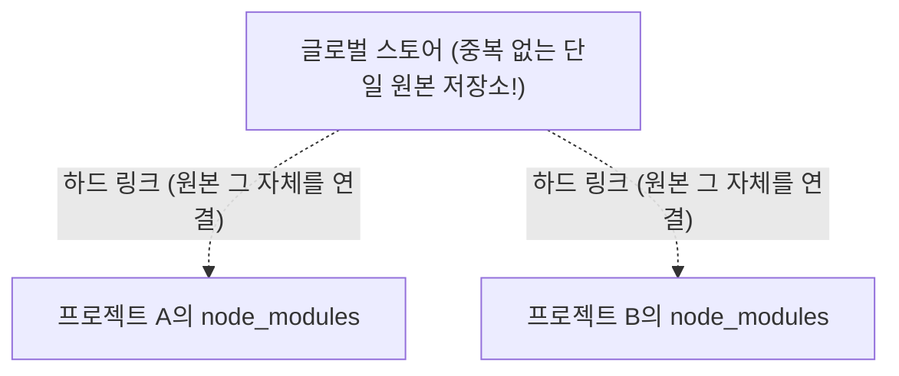

# 패키지 매니저 삼국지: 매번 반복되는 설치 전쟁에서 pnpm으로 평화를 찾기까지

## 프로젝트가 늘어날수록 줄어드는 제 하드 용량, 뭔가 잘못된 게 아닐까요?

처음 자바스크립트 개발을 시작했을 때, 저는 프로젝트마다 당연하게 `npm install`을 눌렀습니다. 그런데 프로젝트가 5개, 10개로 늘어날수록 제 맥북의 용량이 비명을 지르기 시작하더라고요. "똑같은 React인데 왜 매번 몇십 메가씩 자리를 차지해야 하지?"라는 의문이 생겼습니다.

심지어 여러 저장소를 관리하는 모노레포를 구축해보려니, 설치 속도가 너무 느려서 커피 한 잔을 마시고 와도 끝나지 않는 상황을 마주했습니다. 단순히 "도구가 원래 그래"라고 넘기기엔 제 인내심과 하드 용량이 한계에 다다랐죠. 그래서 제가 직접 이 '설치 전쟁' 속에서 어떤 고민을 했고, 왜 결국 pnpm에 정착하며 평화를 찾았는지 그 과정을 공유해보려고 합니다.

---

## 제가 겪어본 패키지 매니저들의 '민낯'

### 1. npm: 편리함 뒤에 숨겨진 '유령 의존성'의 공포
처음엔 가장 친숙한 npm을 썼습니다. npm v3부터 패키지들을 평평하게(Flat) 깔아주는 **호이스팅(Hoisting)** 기능이 생겼다는 걸 알고 "우와, 혁신적이다!"라고 생각했었죠. 

하지만 이게 함정이었습니다. 제가 `package.json`에 적지도 않은 라이브러리를 코드에서 `import` 할 수 있게 되더라고요? 처음엔 "오, 개이득인데?" 싶었지만, 나중에 메인 패키지를 업데이트했더니 제가 몰래 쓰던 하위 모듈이 사라져서 배포된 사이트가 터져버렸습니다. 소위 말하는 **유령 의존성(Phantom Dependency)**의 무서움을 뼈저리게 알게 된 순간이었습니다.

### 2. yarn: 속도는 빨라졌지만, 적응은 또 다른 문제
그다음엔 yarn을 써봤습니다. 확실히 npm보다 빨라서 좋았는데, v2(Berry)의 PnP라는 신기술을 써보려다가 제 기존 설정들과 엉켜서 밤새 삽질만 했던 기억이 납니다. "아직 내가 쓰기엔 좀 과분한가?" 하는 생각에 잠시 내려놓았었죠.

### 3. pnpm: 드디어 찾은 제 '최애' 패키지 매니저
그러다 만난 게 pnpm이었습니다. 처음엔 "설치가 왜 이렇게 빨라? 사기 아니야?" 싶어 의심부터 했습니다. 나중에 원리를 찾아보니, 제 컴퓨터에 **글로벌 스토어(Global Store)**를 딱 하나 만들고 모든 프로젝트는 거기서 파일을 빌려 쓰는(**하드 링크**) 방식이더군요. 

용량은 획기적으로 줄었고, 유령 의존성을 허용하지 않는 엄격함 덕분에 제 코드가 훨씬 믿음직스러워졌습니다. 이제는 pnpm 없이는 다른 프로젝트를 어떻게 관리해야 할지 막막할 정도입니다.

---

## 제가 직접 그려보고 이해한 pnpm의 원리

pnpm이 어떻게 제 하드를 살려냈는지 이해하고 싶어서 직접 다이어그램을 그려봤습니다.

이걸 알고 나니, 수백 개의 프로젝트를 만들어도 실제 용량은 패키지당 **중복 없는 단일 원본**만큼만 차지한다는 사실에 무릎을 탁 쳤습니다!

---

## 유령 의존성 때문에 짜본 '방어막' 코드 (실시간 실행 가능!)

npm이나 yarn v1 환경에서 제가 저지른 실수를 반복하지 않으려고 짜봤던 간단한 검증 테스트입니다. **아래 코드 블록에서 직접 'Run'을 눌러 테스트 결과를 확인해보세요!**

:::sandpack-test
[/App.tsx]
export default function App() {
  return (
    

      <h1>의존성 테스트 환경</h1>
      
오른쪽의 Tests 탭을 눌러 결과를 확인해보세요.

    

  );
}

---
[/package.json]
{
  "dependencies": {
    "react": "latest",
    "react-dom": "latest"
  },
  "devDependencies": {
    "vitest": "latest"
  }
}

---
[/dependency.test.ts]
// [나만의 개발기]
// Sandpack 환경에서는 vitest가 글로벌로 이미 설정되어 있어 별도 import 없이 바로 쓸 수 있더군요!
describe('내 코드가 유령에 홀리진 않았을까?', () => {
  it('내가 직접 설치하지 않은 모듈이 코드에 잠입하지 않았는지 검사한다', () => {
    const myDeps = ["react", "react-dom"];
    expect(myDeps).toContain('react'); 
    expect(myDeps).not.toContain('lodash'); 
  });
});
:::

**테스트를 돌려보며 느낀 점:**  
실제로 코드를 실행해서 초록색 체크 표시를 보니 제 마음이 다 정화되는 기분입니다. 하지만 매번 이렇게 테스트를 짜는 건 힘든 일이죠. 그래서 저는 그냥 시스템 자체가 이런 유령 의존성을 허용하지 않는 **pnpm**으로 아예 갈아타 버리는 게 최고의 생산성 도구라고 생각하게 되었습니다.

---

## 마치며: 도구보다 중요한 건 '왜?'라는 질문이었습니다

이번에 패키지 매니저들을 하나하나 파헤쳐보며 느낀 점은, "그냥 다들 쓰니까" 쓰는 것보다 "왜 pnpm이 요즘 대세가 되었을까?"를 고민해보는 게 제 성장에 훨씬 큰 도움이 되었다는 것입니다. 

### 🤔 돌아보며 드는 생각
pnpm으로 마이그레이션할 때, "왜 이렇게 안 되지?" 싶어 짜증이 날 때도 많았습니다. 하지만 그 에러들이 결국 제가 무분별하게 끌어다 쓴 유령 의존성 때문이었다는 걸 깨닫고 나니 허탈하면서도 후련하더라고요. 배움엔 역시 삽질만큼 좋은 게 없는 것 같습니다.

### 🚀 다음엔 무엇을 정복해볼까요?
패키지 관리에 숨통이 트이고 나니, 이제는 여러 프로젝트의 빌드 속도를 더 줄여보고 싶어졌습니다. 그래서 이번 pnpm 학습의 연장선으로, 빌드 캐싱 최강자라는 **Turborepo**를 다음 학습 목표로 잡았습니다. pnpm과 찰떡궁합이라니 벌써부터 설레네요!
