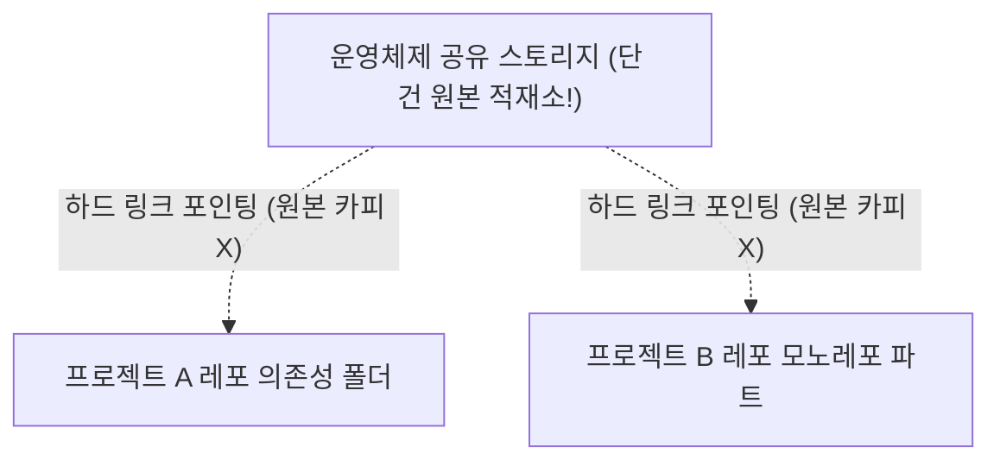

# 패키지 매니저 삼국지: 무거운 모듈 의존성 지옥에서 pnpm 전환기

현대 자바스크립트 생태계에서 신규 프론트엔드 또는 백엔드(Node.js) 프로젝트의 레포지토리를 파게 될 때면 관성처럼 숨 쉬듯 `npm install` 명령어를 타건했다. 

하지만 토이 프로젝트 개수가 10개를 넘어가면서 맥북 하드디스크의 용량 게이지는 터질 듯 비명을 불렀고, 도메인 아키텍처를 하나로 통합하기 위해 모노레포를 구축해 쪼개는 빌드 시스템 단계를 시도하자 배포 파이프라인에서 수시로 모듈 파손 오류가 도출되기 시작했다. 
기능 개발 코드 외적인 "패키지 모듈 의존성 엔진"에 대한 한계를 뼈저리게 부딪힌 시기에, 그 대안을 pnpm이라는 생태계로 전향하며 돌파했던 과정에 대한 아키텍처 회고를 정리한다.

---

## 🛑 마주쳤던 기존 패키지 엔진들의 민낯과 한계

### 1. npm: 편리함의 베일 뒤에 숨은 '유령 의존성(Phantom Dependency)'의 함정
초기 모노레포 구조에서, 최상단 루트에만 깔아둔 패키지가 하위 다른 작업 트리 컴포넌트의 소스 코드에서 별도의 설치 선언(`package.json` 명시) 없이도 `import`가 버젓이 먹혀 들어가는 기현상을 겪었다. 

npm v3부터 중복 설치를 없애기 위해 엔진이 모듈들을 최상위로 끌어올려 평평하게(Flat) 깔아버리는 **호이스팅(Hoisting)** 전략의 이면이었다. 개발할 때는 편리했으나, 막상 빌드 CI 파이프라인 컨테이너에 올리기 위해 패키지를 떼어내자 "내가 선언한 적은 없지만 암묵적으로 가져다 쓰던 유령 라이브러리"들이 몽땅 소실되어 프로덕션 런타임 에러가 치명적으로 폭발해 버렸다.

### 2. 하드 용량 파괴: 똑같은 React를 수십 번 복사
저장소를 분기마다 새로 세팅할 때 공통으로 들어가는 기본 라이브러리인 React나 Webpack 바이너리 패키지가, 단순히 디렉토리가 다르다는 이유만으로 각 `node_modules`마다 물리적으로 수십 메가바이트씩 중복 카피 다운로드를 유발하며 수 기가바이트의 쓰레기 더미 용량을 지속적으로 산출해 냈다.

---

## 🛠️ 해결 전환점: 원본(Store) 대여 생태계 pnpm의 도입

오류와 느린 빌드 시간에 지쳐 대안 아키텍처를 뒤지던 중, 패키지 파일의 생성 처리 철학 자체가 완전히 다른 pnpm 환경 체제로 레포 구조를 전부 갈아엎고 마이그레이션을 과감하게 집행했다.

1. **엄격한 의존성 격리 (Strictness)**: pnpm은 자신이 개발하는 루트 `package.json`에 명확히 문자로 타이핑되어 선언 명시된 패키지만을 로컬로 연결해 주었다. 내가 설치하지 않은 유령 하위 패키지가 감히 오토 임포트로 딸려 오는 부실한 환경 자체를 아토믹하게 차단해 내어 CI 빌드 실패 오류를 완전히 박멸시켰다.
2. **글로벌 스토어와 하드 링크 (Hard link)**: 이 방식의 경이로움은 하드 디스크 관리에서 체감했다. 시스템 OS 차원에 특정 글로벌 스토어 공간 단 하나에만 다운로드 스냅샷 원본을 박아버리고, 수십 개의 로컬 프로젝트들은 오직 해당 원본 위치를 향해 **하드 링크 파일 포인터**만 걸어 둔 채 허수 디렉터리만을 빌려다 쓰는 환상적인 공유 배급 구조였다. 무한 생성되던 하드 용량 증식을 획기적으로 감축시켰을뿐더러, 이미 있는 모듈의 연동 속도는 수초 미만 스펙으로 다이어트 최적화가 이뤄졌다.

```mermaid
graph TD
    Store["운영체제 공유 스토리지 (단 건 원본 적재소!)"]
    ProjectA["프로젝트 A 레포 의존성 폴더"]
    ProjectB["프로젝트 B 레포 모노레포 파트"]
    
    %% 실제 복사가 아닌 주소 참조 하드링크 연결
    Store -.->|"하드 링크 포인팅 (원본 카피 X)"| ProjectA
    Store -.->|"하드 링크 포인팅 (원본 카피 X)"| ProjectB
```

---

## 💡 최종 회고와 도출된 성과 지표

단순히 관성대로 터미널 명령어를 입력하던 방식에서 벗어나, "의존성 패키지 덩어리들이 디스크 내에 어떠한 파일 시스템 구조로 매핑 구동되는가?"에 대한 집요한 원리 탐구를 진행한 뜻깊은 마이그레이션 적용기였다.

pnpm 전환 후 로컬 CI 빌드 시 소요 시간이 절반을 밑돌게 단축되었으며, 무엇보다 프로젝트 트리 내부에 "내가 통제하지 않은 폭탄 모듈"이 없다는 확고한 신뢰 구조를 획득할 수 있었다. 이는 곧이어 복합 빌드 공유 플랫폼인 Turborepo 등의 모노레포 파이프라인 아키텍처 학습을 시도하는 발판으로서도 무척 단단한 초석이 되어 주었다.
